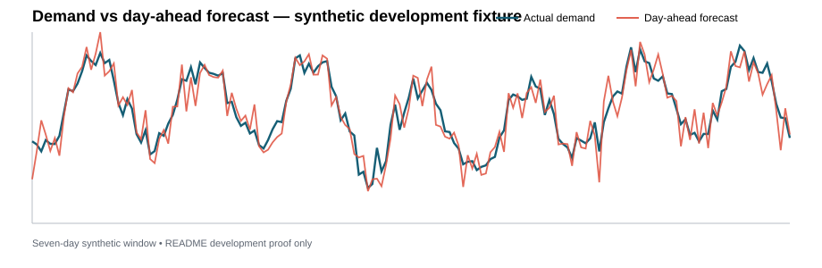
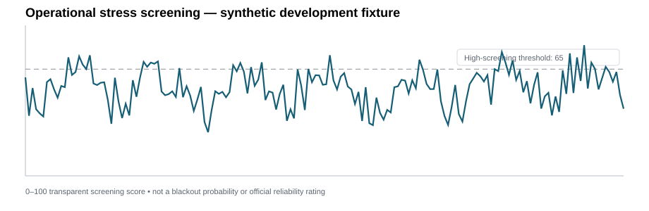

# GridPulse — Energy Demand & Grid Stress Analytics

**Hourly demand → forecast error → ramping → generation mix → interchange → QA review → stress screening → forecasting → operational dashboard**

GridPulse is a visual-first energy analytics project built around U.S. Energy Information Administration Form EIA-930 hourly grid data. The central question is:

> **When does electricity demand become unusually difficult to forecast or serve, what operating conditions coincide with those hours, and can a model improve on the actual EIA-reported day-ahead forecast?**

The project is intentionally broader than a forecasting notebook. It combines reproducible data engineering, time-series diagnostics, forecast-performance analysis, transparent source-data QA, stress screening, generation-mix context, and a dashboard designed to make operating patterns inspectable.

> **Current phase:** the downloaded EIA BALANCE files are the production path. The API client remains available as an optional route, while the dashboard defaults to a frozen local analytical dataset for reproducibility.

## Visual proof — current repository state





The two committed SVGs above are still the clearly labeled synthetic development snapshots.

`scripts/generate_readme_figures.py` has already been upgraded to produce three genuine PJM EIA-930 visuals from the prepared 2022–2025 dataset:

- 2025 peak demand vs EIA day-ahead forecast,
- 2025 EIA-vs-weekly-naive forecasting benchmark,
- June 2025 generation mix.

Those three real-data SVG outputs are **not committed yet**. GridPulse will not reference them here as completed evidence until the files themselves are reviewed and added to the repository.

## Source snapshot

The production snapshot uses **eight official EIA-930 six-month BALANCE CSV files** covering PJM from 2022 through 2025 local time. Exact filenames and SHA-256 hashes are recorded in `DATASET_MANIFEST.md`.

The ingestion path:

- reads the large all-balancing-authority files in chunks,
- filters to PJM before concatenation,
- normalizes the mid-2024 schema change,
- prefers adjusted demand/generation/interchange values when available,
- preserves imputation flags,
- standardizes operating values on **MW** fields such as `demand_mw`, `forecast_mw`, and `net_generation_mw`.

No additional source download is required for the current analysis/modeling phase.

## Data workflow

```text
Eight frozen EIA-930 BALANCE CSV files
        ↓
PJM filtering before concatenation
        ↓
2024 schema normalization + MW standardization
        ↓
hourly operating table + long generation-mix table
        ↓
missing-hour / duplicate / missing-value QA
        ↓
non-mutating source-anomaly flags
        ↓
operational feature engineering
        ↓
transparent stress screening
        ↓
Parquet analytical layer
        ↓
dashboard + EIA benchmark + ML candidate validation
```

The local-data path is designed to make every model and figure reproducible from the same source snapshot.

## Prepare downloaded data

Keep the eight BALANCE files under a local raw-data folder, for example:

```text
data/raw/eia930/
├── EIA930_BALANCE_2022_Jan_Jun.csv
├── EIA930_BALANCE_2022_Jul_Dec.csv
├── ...
└── EIA930_BALANCE_2025_Jul_Dec.csv
```

Then run:

```bash
python scripts/prepare_downloaded_eia.py \
  --balance-source data/raw/eia930 \
  --respondent PJM \
  --output-dir data/processed
```

The script creates:

```text
data/processed/gridpulse_hourly.parquet
data/processed/gridpulse_fuel_mix.parquet
data/processed/qa_summary.json
```

The dashboard reads those Parquet files directly. No API key is required.

## Dashboard surfaces

GridPulse supports the following analytical views:

1. **Demand vs day-ahead forecast** — hourly operating overlay.
2. **Forecast-error distribution** — signed under- vs over-forecasting.
3. **Demand ramp timeline** — separates rapid changes from absolute load level.
4. **Demand heatmap** — date × hour structure for recurring load shape and unusual days.
5. **Operational-stress timeline** — transparent 0–100 screening signal.
6. **Net generation + interchange** — supply context around high-demand periods.
7. **Highest-stress event table** — turns the composite score back into inspectable evidence.
8. **Source-data QA anomaly table** — keeps suspicious reported hours visible instead of silently correcting them.
9. **Generation mix by energy source** — stacked hourly generation from the BALANCE files.
10. **Renewable generation share** — descriptive generation-portfolio context.
11. **Out-of-time forecasting benchmark** — EIA day-ahead vs weekly naive vs the first ML candidate on identical holdout rows.
12. **Peak-demand forecasting benchmark** — top-decile demand MAE using one shared peak threshold.
13. **Model promotion gate** — prevents a candidate from claiming a win merely by beating a weak baseline.
14. **KPI strip** — peak demand, EIA forecast MAE, maximum hourly ramp, and maximum stress signal.
15. **Data-QA sidebar** — missing hours, duplicates, missing components, imputation counts, and flagged anomaly hours.

Every major dashboard output includes a short plain-language interpretation.

## Source-data QA policy

GridPulse treats suspicious source observations as evidence to investigate, not values to quietly erase.

The current row-level rules flag:

- an isolated one-hour demand discontinuity when a large step is immediately reversed in the following hour, or
- a large exact-hour demand step that coincides with a large generation-demand-interchange balance residual.

The default QA thresholds are a **25% demand step** and a **10,000 MW absolute balance residual**. These are project heuristics, not EIA correction rules.

A motivating event occurs on **November 21, 2024 around noon local time**, when PJM demand falls from roughly **94.8 GW to 56.3 GW and then returns to 95.5 GW** over three consecutive hours while net generation remains near **98 GW**. GridPulse retains the reported values and flags the discontinuity rather than smoothing, clipping, interpolating, or deleting it.

## Stress screening

The initial screening score remains deliberately simple and inspectable:

```text
40% demand percentile
25% absolute forecast-error percentile
20% normalized absolute hourly demand ramp
15% interchange-dependence percentile
```

These weights are **provisional analytical assumptions**. If a component is missing, GridPulse reweights over the available components instead of treating the missing value as zero. The score is a screening device, not an official EIA/NERC reliability rating and not a blackout prediction.

## Forecasting standard

The weekly-naive forecast remains a useful diagnostic baseline:

> **Predict each hour using demand from the same exact UTC hour one week earlier.**

But beating that baseline is no longer enough to earn portfolio credit.

GridPulse now evaluates three forecasts on the **same future holdout rows**:

- **EIA-reported day-ahead forecast** — the operational source benchmark,
- **same hour last week** — the deliberately simple diagnostic baseline,
- **ML-corrected EIA** — the first GridPulse model candidate.

Headline metrics:

- MAE,
- RMSE,
- sMAPE,
- top-decile-demand MAE.

Peak hours are defined with one shared demand threshold, and every forecast is scored on identical rows.

### Minimum model promotion gate

A GridPulse ML candidate does **not** earn a forecasting win merely for beating the weekly-naive baseline.

The minimum gate requires the candidate to beat the **EIA-reported day-ahead forecast** on both:

1. overall holdout MAE, and
2. peak-hour MAE.

Passing that gate is necessary, not sufficient. Rolling-origin stability and error-slice review are still required before the project claims a durable forecasting improvement.

## First ML candidate

The first candidate is intentionally narrow: a gradient-boosted residual correction to the reported EIA day-ahead forecast.

It predicts:

```text
actual demand − EIA forecast
```

and adds the predicted residual back to `forecast_mw`.

The feature set contains:

- target-hour EIA `forecast_mw`,
- cyclical hour-of-day, day-of-week, and month terms,
- exact demand lags at 48, 168, and 336 hours,
- exact EIA forecast-error lags at 48 and 168 hours.

Observed-demand and prior-error features are lagged by **at least 48 hours** to keep the timing conservative for a day-ahead comparison. No contemporaneous target-hour demand, generation, or interchange values are supplied to the model.

QA-flagged source observations remain in the headline benchmark. Any sensitivity analysis that excludes them must be explicitly labeled as secondary.

## Modeling roadmap

1. EIA-reported day-ahead benchmark,
2. weekly-naive diagnostic baseline,
3. gradient-boosted EIA residual-correction candidate,
4. rolling-origin validation,
5. peak-hour / hour-of-day / seasonal error slices,
6. QA-anomaly sensitivity review,
7. SHAP only if the tree model materially earns its added complexity.

Random train/test splits are not appropriate for this time-series problem.

## Optional API route

`src/gridpulse/eia.py` remains in the project. The dashboard can still query EIA API v2 when an `EIA_API_KEY` is configured, which is useful for recent-data checks or experiments.

The API is no longer required for the main project workflow.

## Documentation standard

GridPulse follows the portfolio-wide standard:

**Markdown context → humanly commented code → output → Markdown interpretation → limitations / decision relevance.**

The real PJM README figures will replace the synthetic development visuals only after the generated SVG outputs themselves are committed.

## Quick start

```bash
git clone https://github.com/Boatengs/gridpulse-energy-grid-analytics.git
cd gridpulse-energy-grid-analytics
python -m venv .venv
source .venv/bin/activate
pip install -r requirements.txt
pip install -e .
streamlit run app.py
```

## Repository structure

```text
.
├── app.py
├── README.md
├── PROJECT_CHARTER.md
├── METHOD_NOTES.md
├── DATA_DICTIONARY.md
├── DATASET_MANIFEST.md
├── src/gridpulse/
│   ├── balance.py
│   ├── eia.py
│   ├── io.py
│   ├── features.py
│   ├── forecasting.py
│   ├── stress.py
│   └── demo.py
├── scripts/
│   ├── prepare_downloaded_eia.py
│   ├── fetch_eia.py
│   └── generate_readme_figures.py
├── notebooks/
│   └── 01_gridpulse_walkthrough.ipynb
├── tests/
├── data/
├── figures/
└── .github/workflows/ci.yml
```

## Guardrails

- GridPulse does **not** predict blackouts.
- Stress flags describe unusual combinations of observed operating signals and require interpretation.
- QA flags do not silently mutate or delete EIA observations.
- EIA-930 values are operational data and can contain missing, imputed, anomalous, or revised observations.
- Forecast comparisons preserve time order; random train/test splits are not appropriate.
- Forecasts are compared on common rows and a shared peak-demand definition.
- Beating the weekly-naive baseline alone is not considered a model win.
- More complex models are retained only when they improve future-period performance against the EIA operational benchmark and survive additional validation.
- Raw downloaded data is not republished in Git; the repository stores reproducible code, source hashes, and analytical evidence.
