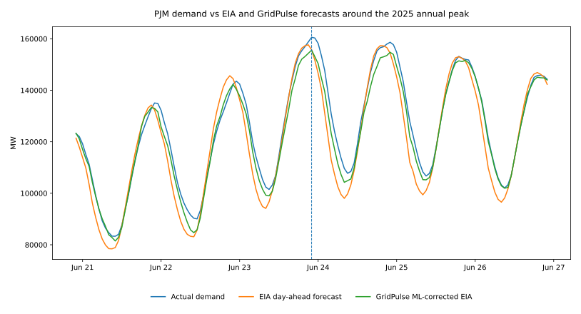
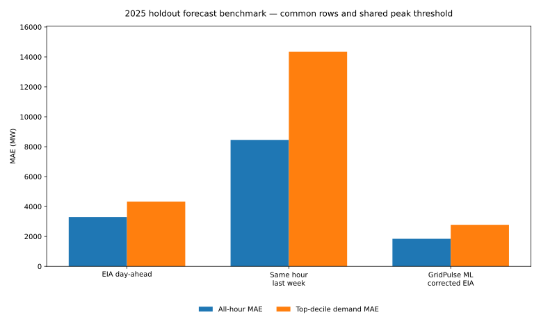
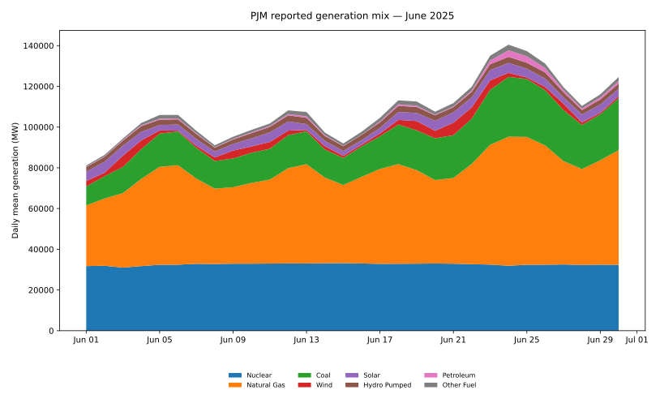

# GridPulse — Energy Demand & Grid Stress Analytics

**Hourly demand → forecast error → ramping → generation mix → interchange → QA review → stress screening → forecasting → live control room**

GridPulse is a visual-first energy analytics project built around U.S. Energy Information Administration Form EIA-930 hourly grid data. The central question is:

> **When does electricity demand become unusually difficult to forecast or serve, what operating conditions coincide with those hours, and can a model improve on the actual EIA-reported day-ahead forecast?**

The project combines reproducible data engineering, time-series diagnostics, source-data QA, operational stress screening, generation-mix context, forecast benchmarking, rolling-origin validation, error-slice intelligence, and a multipage Streamlit dashboard with live/replay operating views.

## Verified result

GridPulse has a real out-of-time PJM result from the frozen 2022–2025 EIA-930 snapshot.

All headline forecasts are scored on the same **8,690 valid 2025 holdout hours**. Peak performance uses one shared top-decile demand threshold of **119,360.1 MW**.

| Forecast | MAE (MW) | RMSE (MW) | sMAPE | Peak MAE (MW) |
|---|---:|---:|---:|---:|
| EIA day-ahead | 3,302.6 | 4,148.3 | 3.49% | 4,330.5 |
| Same hour last week | 8,455.1 | 11,616.9 | 8.43% | 14,342.2 |
| **GridPulse ML-corrected EIA** | **1,842.7** | **2,442.2** | **1.89%** | **2,770.4** |

Against EIA's actual reported day-ahead forecast, the GridPulse candidate reduces:

- **overall MAE by 44.2%**, and
- **peak-demand MAE by 36.0%**.

Expanding-window 30-day rolling-origin validation produced **13 valid future folds**, and the GridPulse candidate beat EIA on both overall and peak-demand MAE in **13 of 13 folds**.

- median overall improvement: **43.7%**,
- median peak improvement: **25.3%**,
- worst-fold overall improvement: **26.9%**,
- worst-fold peak improvement: **15.1%**.

The exact machine-readable outputs are committed under [`results/`](results/README.md).

## Error intelligence: where the model wins and where it does not

The same 8,690 common 2025 rows are decomposed by PJM local hour, month, season, weekday/weekend, and demand decile.

Key findings:

- **23 of 24 local-hour slices beat EIA.** The exception is **08:00 PJM local**, where EIA MAE is 1,668 MW and GridPulse ML MAE is 1,682 MW — a **0.8% regression**.
- The strongest hourly correction is **01:00 PJM local**, with a **72.7% MAE reduction**.
- Every month improves: **July** is strongest at **55.2%**, while **January** is weakest but still improves **26.5%**.
- **JJA** improves **52.0%**; **DJF** improves **28.8%**.
- Weekdays and weekends both improve materially: **45.3%** and **41.1%**, respectively.
- Every demand decile improves on MAE. **D2** is strongest at **55.6%**; the highest-demand decile **D10** is weakest at **36.0%**.

The peak-demand result has an important asymmetry: in D10, mean positive forecast bias falls from roughly **2,149 MW to 1,451 MW**, but the underforecast rate increases from **63.3% for EIA to 69.2% for GridPulse ML**. Peak misses are smaller on average, but residual misses are somewhat more frequently on the low side.

The committed aggregate tables live in `results/error_slices/`, and the Streamlit **Model Error Intelligence** page makes them interactive.

## Live animated control room

GridPulse includes a dedicated Streamlit **Live Control Room** page with three operating modes:

- **Frozen PJM replay** — deterministic portfolio replay from the prepared PJM dataset,
- **Live EIA API** — recent EIA-930 observations when `EIA_API_KEY` is configured,
- **Synthetic demo** — clearly labeled development fallback.

The control room includes:

- browser-side Play/Pause demand-versus-forecast animation,
- selectable replay windows and playback speed,
- optional live API auto-refresh about every five minutes,
- latest-observation timestamp and Fresh / Delayed / Stale / Replay status,
- demand, EIA forecast, forecast error, ramp, generation, interchange, and stress KPIs,
- operational stress gauge,
- recent pulse timeline,
- high-stress event tape,
- QA watch,
- the verified 2025 model result as historical context.

EIA-930 is an **hourly operational feed**, not sub-second SCADA telemetry. The page reports observation age explicitly and does not present stale data as instantaneous live telemetry. See [`LIVE_DASHBOARD.md`](LIVE_DASHBOARD.md) for operation and deployment notes.

## Real PJM evidence



The annual-peak view compares actual PJM demand directly with EIA's reported day-ahead forecast and the GridPulse residual-correction candidate. The ML candidate is not a replacement weather/load-forecast stack; it learns a correction to EIA's forecast using only conservatively timed historical features.



The benchmark uses identical scoring rows and one shared peak-demand threshold. The weekly-naive model remains useful diagnostic context, but it is deliberately **not** the promotion bar; the meaningful comparison is GridPulse versus EIA.



Generation mix provides operating context around the summer-demand period rather than being used as contemporaneous target-hour information in the forecasting model.

The older `demo_*.svg` files remain in `figures/` as clearly labeled synthetic development fixtures, not portfolio evidence.

## Source snapshot

The production snapshot uses **eight official EIA-930 six-month BALANCE CSV files** covering PJM from 2022 through 2025 local time. Exact filenames and SHA-256 hashes are recorded in `DATASET_MANIFEST.md`.

For the verified result, the files were re-fetched from EIA's official six-month archive and every SHA-256 matched the frozen manifest before preparation or modeling. The compact verification record is committed at `results/source_verification.json`.

The ingestion path:

- reads the large all-balancing-authority files in chunks,
- filters to PJM before concatenation,
- normalizes the mid-2024 schema change,
- prefers adjusted demand/generation/interchange values when available,
- preserves imputation flags,
- standardizes operating values on **MW** fields such as `demand_mw`, `forecast_mw`, and `net_generation_mw`.

The prepared PJM table contains **35,064 hourly rows**, with no duplicate UTC timestamps and no missing hourly slots across the frozen coverage window.

## Data workflow

```text
Eight frozen EIA-930 BALANCE CSV files
        ↓
SHA-256 snapshot verification
        ↓
PJM filtering before concatenation
        ↓
2024 schema normalization + MW standardization
        ↓
hourly operating table + long generation-mix table
        ↓
missing-hour / duplicate / missing-value QA
        ↓
non-mutating source-anomaly flags
        ↓
operational feature engineering + stress screening
        ↓
Parquet analytical layer
        ↓
EIA benchmark + ML candidate + rolling-origin validation
        ↓
error slices + live/replay dashboard + committed evidence
```

## Prepare downloaded data

Keep the eight BALANCE files under a local raw-data folder, for example:

```text
data/raw/eia930/
├── EIA930_BALANCE_2022_Jan_Jun.csv
├── EIA930_BALANCE_2022_Jul_Dec.csv
├── ...
└── EIA930_BALANCE_2025_Jul_Dec.csv
```

Then run:

```bash
python scripts/prepare_downloaded_eia.py \
  --balance-source data/raw/eia930 \
  --respondent PJM \
  --output-dir data/processed
```

The script creates:

```text
data/processed/gridpulse_hourly.parquet
data/processed/gridpulse_fuel_mix.parquet
data/processed/qa_summary.json
```

Raw source files and processed Parquet tables are intentionally not republished in Git.

## Source-data QA policy

GridPulse treats suspicious source observations as evidence to investigate, not values to quietly erase.

The current row-level rules flag:

- an isolated one-hour demand discontinuity when a large step is immediately reversed in the following hour, or
- a large exact-hour demand step that coincides with a large generation-demand-interchange balance residual.

The default QA thresholds are a **25% demand step** and a **10,000 MW absolute balance residual**. These are project heuristics, not EIA correction rules.

The frozen snapshot contains one combined QA anomaly: **November 21, 2024 at 12:00 PM PJM local time**. Reported demand falls from **94,812 MW to 56,260 MW and then returns to 95,482 MW**, while reported net generation remains near **98,000 MW**. GridPulse retains the observation and flags it rather than smoothing, clipping, interpolating, or deleting it.

## Stress screening

The initial screening score is deliberately simple and inspectable:

```text
40% demand percentile
25% absolute forecast-error percentile
20% normalized absolute hourly demand ramp
15% interchange-dependence percentile
```

If a component is missing, GridPulse reweights over available components rather than treating the missing value as zero.

The stress score is a screening device. It is **not** an official EIA/NERC reliability rating and **not** a blackout probability.

## Forecasting standard

The weekly-naive forecast predicts each hour using demand from the same exact UTC hour one week earlier. It is retained because a simple baseline is useful, but beating it is not considered a portfolio win.

GridPulse compares three forecasts on common future rows:

- **EIA-reported day-ahead forecast** — the operational source benchmark,
- **same hour last week** — the diagnostic baseline,
- **ML-corrected EIA** — the GridPulse candidate.

Headline metrics are MAE, RMSE, sMAPE, and top-decile-demand MAE.

### Minimum promotion gate

A candidate must beat EIA on both:

1. overall holdout MAE, and
2. peak-hour MAE.

The current candidate passes both conditions on the 2025 headline holdout and on every valid rolling-origin fold in the current evaluation.

## First ML candidate

The first candidate is intentionally narrow: a gradient-boosted residual correction to the reported EIA day-ahead forecast.

It predicts:

```text
actual demand − EIA forecast
```

and adds the predicted residual back to `forecast_mw`.

The feature set contains:

- target-hour EIA `forecast_mw`,
- cyclical hour-of-day, day-of-week, and month terms,
- exact demand lags at 48, 168, and 336 hours,
- exact EIA forecast-error lags at 48 and 168 hours.

Observed-demand and prior-error features are lagged by **at least 48 hours**. No contemporaneous target-hour demand, generation, or interchange values are supplied to the model.

## Rolling-origin validation

`scripts/evaluate_models.py` runs the headline 2025 benchmark and expanding-window future folds. The default project evaluation uses 30-day horizons stepped forward 30 days at a time.

For each fold:

- training history ends before the fold begins,
- EIA, weekly naive, and ML are scored on identical valid rows,
- one common peak-demand threshold is used within the fold,
- the existing EIA promotion gate is recorded transparently.

The committed fold-level evidence is in `results/rolling_origin_folds.csv`.

## Dashboard surfaces

The Streamlit app now includes the original analytical dashboard plus dedicated **Live Control Room** and **Model Error Intelligence** pages. Across those surfaces GridPulse provides:

1. demand vs day-ahead forecast,
2. forecast-error distribution,
3. demand ramp timeline,
4. demand heatmap,
5. operational-stress timeline,
6. net generation + interchange,
7. highest-stress event table,
8. source-data QA anomaly table,
9. generation mix by energy source,
10. renewable generation share,
11. EIA vs weekly naive vs ML out-of-time benchmark,
12. peak-demand forecast benchmark,
13. model promotion gate,
14. animated historical replay with Play/Pause,
15. live EIA API refresh with freshness labeling,
16. current operating KPI and stress-gauge view,
17. hour/month/season/day-type/demand-decile error intelligence,
18. signed forecast-bias and underforecast-rate diagnostics.

Every major dashboard output includes a short plain-language interpretation or decision boundary.

## Current interpretation

The current evidence supports a strong but bounded statement:

> On the frozen PJM 2022–2025 EIA-930 snapshot, using the documented feature timing and 2025 out-of-time evaluation, the GridPulse residual-correction candidate materially improves on EIA's reported day-ahead forecast and that improvement is stable across the project's rolling-origin folds.

The slice analysis adds two important qualifiers: the model is not better in every local-hour slice, and lower peak MAE does not eliminate a tendency to underforecast peak hours.

The result does **not** establish superiority for other balancing authorities, other years, revised future source snapshots, or a production forecasting stack with different information availability.

## Next analytical extensions

- broader balancing-authority replication,
- tighter feature-availability audits against an explicit forecast-issuance clock if available,
- targeted investigation of the 08:00 local regression,
- peak-focused calibration or asymmetric-loss experiments to address D10 underforecast frequency,
- SHAP only if explanation work remains useful after these robustness checks.

Random train/test splits are not appropriate for this time-series problem.

## Optional API route

`src/gridpulse/eia.py` remains in the project. The Live Control Room can query EIA API v2 when an `EIA_API_KEY` is configured. The API is not required for the main frozen-snapshot workflow.

## Quick start

```bash
git clone https://github.com/Boatengs/gridpulse-energy-grid-analytics.git
cd gridpulse-energy-grid-analytics
python -m venv .venv
source .venv/bin/activate
pip install -r requirements.txt
pip install -e .
streamlit run app.py
```

Streamlit's page navigation exposes the Live Control Room and Model Error Intelligence pages. See `LIVE_DASHBOARD.md` for live-mode configuration.

## Repository structure

```text
.
├── app.py
├── pages/
│   ├── 1_Live_Control_Room.py
│   └── 2_Model_Error_Intelligence.py
├── README.md
├── LIVE_DASHBOARD.md
├── PROJECT_CHARTER.md
├── METHOD_NOTES.md
├── DATA_DICTIONARY.md
├── DATASET_MANIFEST.md
├── results/
│   ├── README.md
│   ├── headline_benchmark.csv
│   ├── model_evaluation_summary.json
│   ├── rolling_origin_folds.csv
│   ├── source_verification.json
│   └── error_slices/
│       ├── hour.csv
│       ├── month.csv
│       ├── season.csv
│       ├── day_type.csv
│       ├── demand_decile.csv
│       └── summary.json
├── src/gridpulse/
│   ├── balance.py
│   ├── eia.py
│   ├── features.py
│   ├── forecasting.py
│   ├── io.py
│   ├── live.py
│   ├── slicing.py
│   ├── stress.py
│   └── validation.py
├── scripts/
│   ├── prepare_downloaded_eia.py
│   ├── evaluate_models.py
│   ├── generate_error_slices.py
│   ├── fetch_eia.py
│   └── generate_readme_figures.py
├── notebooks/
├── tests/
├── data/
├── figures/
└── .github/workflows/ci.yml
```

## Guardrails

- GridPulse does **not** predict blackouts.
- Stress flags describe unusual combinations of observed operating signals and require interpretation.
- QA flags do not silently mutate or delete EIA observations.
- EIA-930 values can contain missing, imputed, anomalous, delayed, or revised observations.
- Live EIA mode is hourly operational monitoring, not sub-second telemetry.
- Forecast comparisons preserve chronological order.
- Forecasts are compared on common rows and a shared peak-demand definition.
- Beating the weekly-naive baseline alone is not considered a model win.
- Lower MAE is reported separately from signed bias and underforecast frequency.
- Raw downloaded data is not republished in Git; the repository stores reproducible code, source hashes, compact result tables, and analytical figures.
